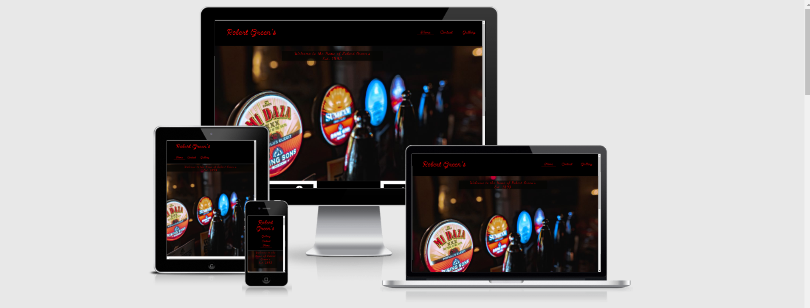

# Robert Green's

The Website is a page for Robert Green's bar where potential customers can find opening times, food serving times, contact information and a variety of pictures to give them a better idea and more information on the place with an ability to contact and find out more. 

It is built to be visually appealing, whilst providing good concise information to users of the site. 

 

 # Features

 The website contains three pages. All of which are accessible from the navigation menu in the header of every page. 

  ##  Header:

- This Header is consistent across every page of the site.

 - Featured on the left of the header is the Logo for Robert Greens which is also used as an internal navigation link to return to the home page.
 
 - On the right of the header section are three more navigation links with the names: Home, Contact and Gallery. These are internal navigation links that take the user to different pages of the website: the Home page, Contact page and Gallery page respectively.

 - The color used for the navigation links is well contrasted with the background for easy readabiltity and helps users transfer to different areas of the site with ease.

## Footer

- The footer is consistent across every page of the site.

- The footer contains a contact number so users can contact the business to enquire further over any queries.

- The footer contains social media links to Facebook, Twitter and Instagram and is represented in the form of each logo for each site. 

# Home Page

 ## The Home Image Section:

- A Decorative image is featured displaying some of the Beers available on draft with a small message welcoming the user to the site.

## The Opening hours and About us section:

- The left of this section is a div block with information on opening times for the week and food serving times.

- The right of this section is a div block with some background information and history on the premises.

- This section is displayed in white color on a black background, this large contrast is to ensure the easiest readability on the most dense text area of the site. 

# Club Page

- The Club page has a form to collect details from users who would like to enroll into Robert Green's wine club.

- This form takes details for First name, Last name and Email address.

# Gallery Page

- The Gallery Page is a page with multiple images to display in and around the venue, it is visually stimulating and is designed to make users of the site want to visit Robert Green's bar. 

# Testing

- I tested this website on Chrome, Firefox and Safari and after minor tweaks it works perfectly across all of them.
- I confirmed that this project looks good and is responsive across all screen sizes using "inspect" and applying my page to different devices. 
- I confirmed that all of my text is easily readble throughout my project.
- I have confirmed that all of my social media links work and open in seperate tabs.
- I have confirmed that my Club form works, and requires all information (First name, Last name and Email address.) before it can be submitted.

# Bugs

## Fixed

- When testing I found that the background image I used in my Club page would not load in safari as it was in ".webp" format, once i changed this to ".jpeg" it worked fine.

- When loading the page originally i found that the page was slow to load images, so I resized them and page performance increased significantly.

## Unfixed

- There are no unfixed bugs.

# Validator Testing

- HTML
No errors were returned when passing through the official W3C validator at time of submission.

-CSS
No errors were returned when passing through the official W3C validator at time of submission.

- Accessibility
I have confirmed that the site runs well by running it through "Lighthouse" on devtools and recieving good ratings in performance, Accessibilty, Best practises and SEO 

!

# Credits

 - I used "Send Flowers" font and "Dancing script" from Google Fonts 

- I used some stock "wine images" from pexels.com

- I Added "font-awesome" source code from love running project.

- Added Social icons from font awesome

- I used some text from https://corkheritagepubs.com/pub/arthur-maynes/ as a bar description in the about us section, I manage this bar and have full permission to do so.
